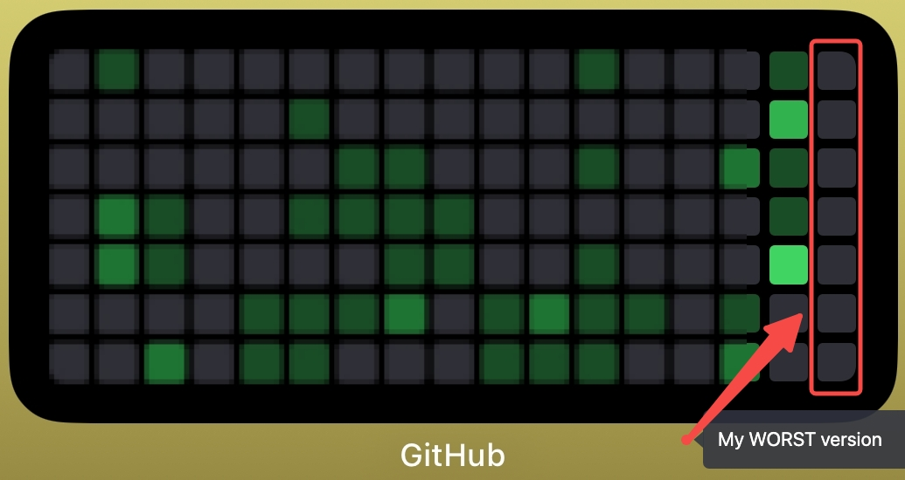

# 🔥 81KM_Q425_Comeback: _The Comeback (**v1**)_

---

## ⏳ Timeline

| Phase                    | Date (Gregorian) | Date (Hijri)  | Day       |
|--------------------------|------------------|---------------|-----------|
| 🌅 **Kickoff**           | 01 Oct 2025      | 08 Rabi2 1447 | Wednesday    |
| 🌌 **Completions**       | 29 Dec 2025      | 08 Rajab 1447  | Monday    |
| ⭐ **Review Replans Day** | 30 Dec 2025      | 09 Rajab 1447  | Tuesday   |
| 🎊 **Celebrations**      | 31 Dec 2025      | 10 Rajab 1447 | Wednesday |
| ✅ **Back to Work**       | 01 Jan 2026       | 11 Rajab 1447 | Thursday  |

---

> 23 Sep '25 (30 Rabi1 '47) Tuesday - I've spiraled down to hit my all-time
> low. Faced the toughest week of self defeat and incompetence, a one full
> of shame, regret and guilt.\
> Potential misused.\
> Purpose dwindled.\
> Promises broken.\
> Self defeated.\
> Imaan shaken.\
> Time wasted.\
> Ashamed.\
> Lost.\
> Even worse: misused the precious blessings of **ALLAH (SWT)** to trade for
> cheap.



> Feeling defeated on all areas of life.
>
> - Spiritually
> - Physically
> - Financially
> - Mentally
> - Socially
> - Emotionally
> - Technically
> - Psychologically

> But I'm not done yet.\
> We never despair from the mercy of ALLAH SWT (and from HIS love)\
> So this is my way back. `My redemption arc`.\
> If I invest my potential right, I can win big for me, my core team, and
> the Ummah in this **dunya and the aakhirah**.

> No more excuses. No more delays.\
> Just pure **consistency**, **discipline**, and **100% effort unlocked**

> Reimagining, redefining, rediscovering and rewriting myself.\
> Comeback is scripted and served.\
> Let's register epic wins.\
> My prime is loading....\
> All to seek the pleasure of **ALLAH SWT**\
> By following our beloved _RASOOLALLAH SAW._

> **Alhamdulillah.**

---

## Daily [Checklist](checklist.md)

---

## My Time Warp

> It's been 4Y I've wasted and it's time\
> Need to relive it in 6M to revive myself.

```math
>> (360 * 4) / (30 * 6)
>> 1 Day of Real = 8 Days of Revive
>> 100M of Real = 1 Day of Revive 
```

---

## Focus Areas

> Need to file 8 slots of 100M each Day\
> Need to file 800 slots in Q425 for reviving 2Y

**Must book 800 slots of 100M each in Q425 _to warp revive 2Y_, In Sha Allah, Aameen.**

1. [Taqwa Boost](#1-taqwa-boost)
2. [Entrepreneurship Barakah](#2-entrepreneurship-barakah)
3. [Software Designs](#3-software-designs)
4. [Fitness Revival](#4-fitness-revival)
5. [Personal Development](#5-personal-growth)

---

### 1. Taqwa Boost

> Boost Imaan and Taqwa of ALLAH SWT.

1. Tahajjud Salah
2. Athan Practice
3. 12 Rakahs Sunnah
4. Witr Salah
5. Ishraaq Salah
6. 1 Juz Qur'an Majeed
	- Juz 15 = Fri = Musabbihaat
	- Juz 16 = Sat
	- Juz 17 = Sun
	- Juz 27 = Mon = Saum
	- Juz 29 = Tue = Musabbihaat
	- Juz 30 = Wed = Musabbihaat
	- Juz 01 = Thu = Saum
7. 1/2: 50 Hadith written and memorised
8. 2/7: Fast every Mondays and Thursdays
9. 3/30: Fast all Ayyam Al-Beed: 13, 14 and 15

---

### 2. Entrepreneurship Barakah

> Earn Rizqun Halaalan Tayyiban Kareem from ALLAH SWT with taqwa.

1. InMasjid App

	- 1+ tested progress commit

	* v0: search
		- developed
		- tested
		- deployed
		- marketed
		- monitored
		- adopted
	* v1: bills
		- developed
		- tested
		- marketed

2. ZupFam App

	- 1+ tested progress commit

	* v0: imenu orders
		- developed
		- tested
		- deployed
		- marketed
		- monitored
		- adopted
	* v1: adtech network
		- developed
		- tested
		- deployed
		- marketed
		- monitored
		- adopted
	* v2: instore social integrations
		- developed
		- tested
		- marketed

3. MVP Home Server
	- imenu app success
	- production grade MVP deployments
	- cloud scale migration ready
4. Company Registrations
	- Team building
	- Official registration
	- DLT registration
	- Payment gateway registration
	- Social media handles
	- Websites and Marketing content

---

### 3. Software Designs

> Learn the fundamentals of software and remove the 'L'.

1. 5 DSA
2. [1.5 hr LLD](#designs-syllabus)
3. [1.5 hr HLD](#designs-syllabus)

---

### 4. Fitness Revival

> Boost imaan, health, wealth, happiness, peace and wellbeing
> of my family by the Fazl of ALLAH SWT.

1. [78KG Diet](#strict-diet)
2. 1 Heavy Bag Workout
3. 100 Dumbbells MPRT
4. 100 LMPP
5. Walk to Masjid 8K

---

### 5. Personal Growth

> Boost Imaan and Taqwa of ALLAH SWT.

1. Public speaking
2. Content creations
	- AI generated posts
	- daily work timelapse
	- twice weekly valuable updates
3. portfolio
4. alhamdulillah

---

#### Strict Diet

> This diet is strictly followed in addition with Organic Healthy Food

1. Breakfast
	- Milk + Overnight Oats/Chapati + Eggs
	- Dry + Fruits + Vegetables
	- Protein Shake
2. Lunch: (only if necessary)
	- Milk
	- Fruits + Vegetables
	- Eggs/Chicken
3. Dinner:
	- Cucumber
	- Tomato
	- Eggs/Chicken
	- Leaves
	- Curd Rice
	- Protein Shake
	- Fish Oil Tablet

---

#### Designs Syllabus

1. LLD:

	- All Design Patterns
	- [Full Udemy course](https://www.udemy.com/course/system_design_lld_hld/learn/)
	- All [Book](file:///Users/alhamdulillah/Books/Techy/LLD) Questions
	- [Full IR course](https://interviewready.io/learn/low-level-design-course)

2. HLD:
	- [Full PlanetScale course](https://planetscale.com/learn/courses/mysql-for-developers)
	- [Full IR course](https://interviewready.io/learn/system-design-course)
	- All [Book](file:///Users/alhamdulillah/Books/Techy/HLD) Questions
	- [Full Udemy course](https://www.udemy.com/course/system_design_lld_hld/learn/)
	- [Full AWS Course](https://www.udemy.com/course/aws-certified-solutions-architect-associate-saa-c03/learn)
